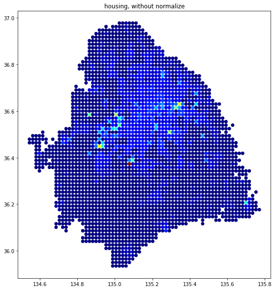

# Quantitative Clustering and Classification study of Urban Functional Area
NYU Shanghai CSCI-SHU 360 Machine Learning project: by Alan, Ella and Steven. 

## Datasets
### Town level
* [Block.csv](Block.csv) : Before training, merged 点评, POI, Housing Price, town level.
* [拟合结果带街道.csv](拟合结果带街道.csv) : Used K-means and Gaussian Mixture to cluster towns. [Result visualization](#).
* [上海街道](/上海街道): Raw shapefiles of Town level Shanghai map.
* [采集结果](/采集结果): Raw data scrapped from 点评.
* [housing_f_t.xlsx](housing_f_t.xlsx): Raw data of housing price connect with town level and fishnet level.
### Fishnet level
* [POI_fishnet_steven.xlsx](POI_fishnet_steven.xlsx): POI values, calculated each fishnet cell.
* [poi_fishnet.xlsx](poi_fishnet.xlsx): similar to previous one.
* [fishnet4900_shanghai.shp](fishnet4900_shanghai.shp): Shapefile of fishnet.
* [POI_Fishnet_for_training.xls](POI_Fishnet_for_training.xls): Early clustering training dataset. 
* [fishnet_centroid.xlsx](fishnet_centroid.xlsx): Fishnet centroid positions.
* [fishnet_density.csv](fishnet_density.csv): Training attributes: 点评,POI,Housing mapped to each fishnet
* [poi_pure.csv](poi_pure.csv): Pure POI coordinates
* [poi.csv](poi.csv): POI coordinates and attribute values
* [housing_kriging.xlsx](housing_kriging.xlsx): Housing data fishnet, with Kriging interpol.
### Fishnet normalized
* [normalized_fishnet_town.csv](normalized_fishnet_town.csv): Early try of normalizing fishnet density
* [norm_f_town_district.csv](norm_f_town_district.csv): Finalized normalization data for training
### Plots
* POI data, without normalization

* POI data, normalized at district level

* POI data, normalized at district level

* Housing data, without normalize

* Housing data, normalized at district level

* Housing data, normalized at town level

## Code
* [dianping-scrapper.py](dianping-scrapper.py): 点评scrapping code.
* [alt.py](alt.py): same as above.
* [cookie.txt](cookie.txt): Cookie generated during scrapping
* [K_Means_街道.ipynb](K_Means_街道.ipynb): Training code. Town level, clustering.
* [poi_dp_house_pop_fish.ipynb](poi_dp_house_pop_fish.ipynb): Training code. Fishnet level, clustering.
* [poi_density_housing_normalize.ipynb](poi_density_housing_normalize.ipynb): Data processing code. Normalizing fishnet data. 
* [Density_POI.ipynb](Density_POI.ipynb): Pure POI data visualization. 